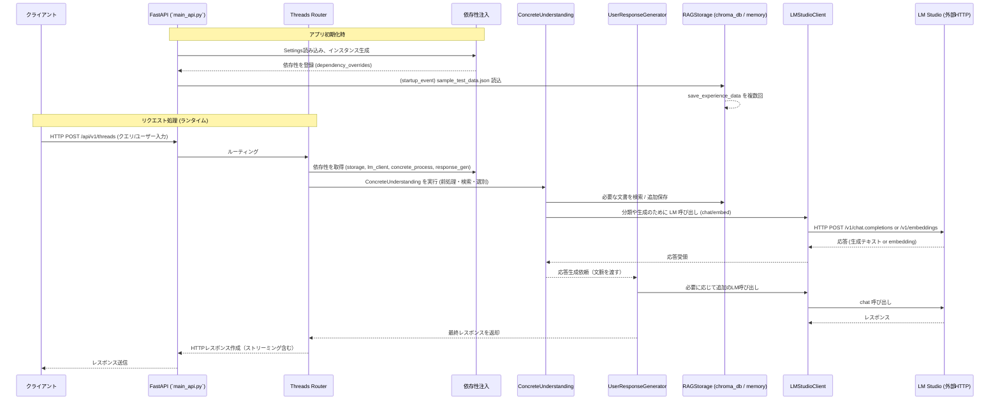

# システム起動とリクエスト処理のフロー

以下は本プロジェクトのバックエンド（`main_api.py` と `lm_studio_rag` クライアント周り）での処理順を示す Mermaid 図です。

## シーケンス図


## フローチャート（高レベル）
```mermaid
flowchart TD
    A[Start: FastAPI 起動] --> B[Settings 読込]
    B --> C[依存性初期化
    (RAGStorage, LMStudioClient,
    ConcreteUnderstanding, ResponseGen)]
    C --> D{USE_MEMORY_STORAGE?}
    D -- Yes --> E[sample_test_data.json を読み込み
    Storage.save_experience_data で登録]
    D -- No --> F[外部 DB を使用]
    E --> G[Ready to accept requests]

    G --> H[Client -> POST /api/v1/threads]
    H --> I[Threads Router: 入力検証・依存性取得]
    I --> J[ConcreteUnderstanding: 検索・前処理]
    J --> K[Storage: 検索/保存]
    J --> L[LMStudioClient: embed/chat 呼び出し]
    L --> M[LM Studio サーバー: HTTP API]
    M --> L
    L --> N[Concrete/ResponseGen に生成結果を返す]
    N --> O[ResponseGen: 最終文章生成（必要ならLM再呼び出し）]
    O --> P[Router: レスポンス整形（ストリーミング）]
    P --> Q[Clientにレスポンス返却]
```

## 短い注釈
- **Startup**: `main_api.py` の `startup_event` がメモリストレージ用の初期データ読み込みを行う。
- **依存性注入**: `app.dependency_overrides[...] = lambda: ...` で実体を束ね、ルーターがこれを利用する。
- **RAGフロー**: ルーター → ConcreteUnderstanding（検索 + LM呼び出し）→ Storage／LM → ResponseGen → Client。
- **LM呼び出し**: `lm_studio_rag/lm_studio_client.py` が `/v1/chat/completions` と `/v1/embeddings` を使って外部LMにHTTPでアクセスする。

---
（必要なら `api/routers/threads` の詳細シーケンスも展開します。希望があれば教えてください）
```mermaid

```